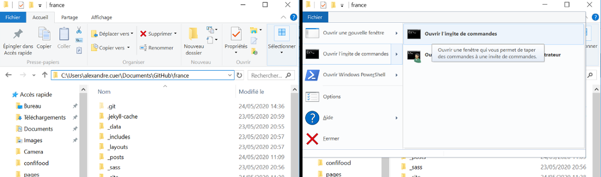
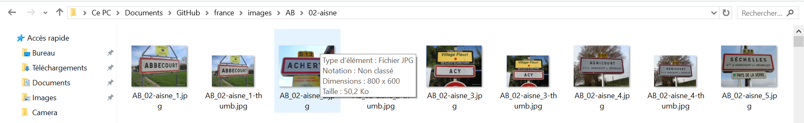

# france

http://panneaux.github.io/france

tous les panneaux de France :-)

## pour ajouter une nouvelle collection

### sous Windows

prérequis :

- il faut avoir l'utilitaire convert.exe de la suite [imagemagick](https://imagemagick.org/script/download.php). Pour l'installer : https://imagemagick.org/download/binaries/ImageMagick-7.0.10-14-Q16-x64-dll.exe


- githubDesktop : https://desktop.github.com/

A l'installation d'imagemagick, cocher la case "install legacy utilities" pour installer convert.exe


Modifier/vérifier le path pour qu'il intègre `C:\Program Files\ImageMagick-7.0.6-Q16\`

Sous windows 10 :
``
Paramètres > Système > Informations système > Paramètres système avancés > Variables d'environnement > Path
``

Window a son propre utilitaire convert. Celui d'ImageMagick doit être en premier
```
$ where convert
c:\Program Files\ImageMagick-7.0.6-Q16\convert.exe
c:\Windows\System32\convert.exe
```

On suppose que :

- vous avez cloné le site via Github Desktop dans un dossier `C:\Users\nom.prenom\Documents\GitHub\france`

- Vous conservez vos photos originales dans un répertoire sur votre bureau, par exemple : `C:\Users\nom.prenom\Documents\GitHub\france\sources`

- Vous chargez un jeu de photos dans ce dossier `sources`, au sein d'un dossier `aisne`


Ouvrez un explorateur Windows depuis le dossier `C:\Users\nom.prenom\Documents\GitHub\france` et lancez un invité de commande msdos depuis ce dossier :


```
traitement.bat sources/aisne AB 02-Aisne
```
celà va créer toutes les images 800x600 et les miniatures au bon endroit



Ensuite il faut aller dans GitHub Desktop, saisir un résumé, faire `commit to master` et `push origin`


## pour faire fonctionner le site en local (facultatif)

il faut avoir jekyll : https://blog.smarchal.com/jekyll-sous-windows
